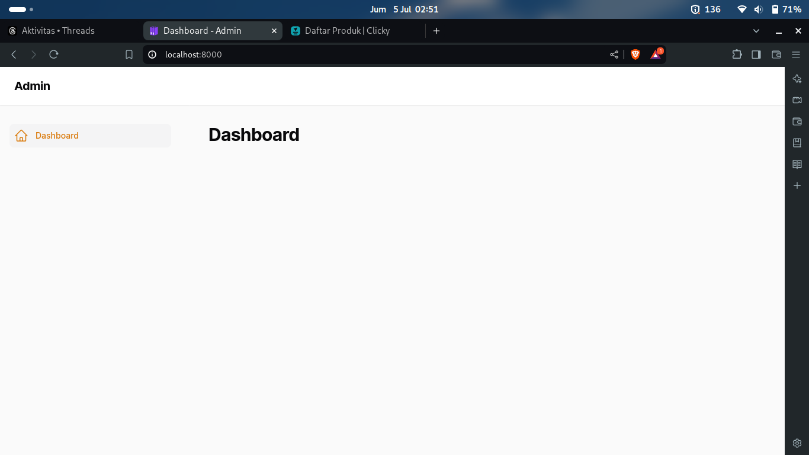

# Template Svelte

Menggunakan [Svelte versi 5](https://svelte-5-preview.vercel.app/docs/introduction).

## [Filament](https://filamentphp.com/)

Lokasi folder `src/admin`. Jadi, di Terminal harus diarahkan ke sana dulu, baru jalankan `php artisan serve`. Jangan lupa `composer install` dulu tapi ya.

## Styling

Styling yang digunakan di template ini adalah [Bootstrap](https://getbootstrap.com/) dan [Uno CSS](https://unocss.dev/).

## Routing

Routing yang digunakan di template ini adalah [Vite Plugin Pages Svelte](https://www.npmjs.com/package/vite-plugin-pages-svelte/v/0.0.1) versi 0.0.1

## Database

Database yang digunakan adalah [Dexie JS](https://dexie.org/)
